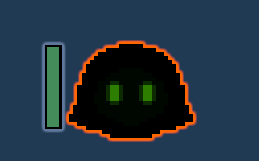
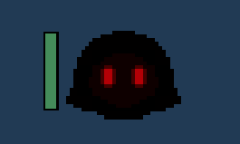
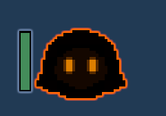
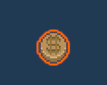
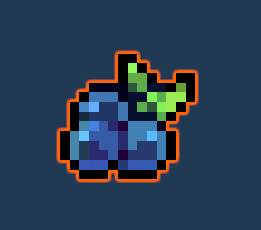
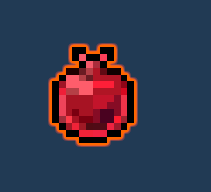
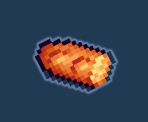
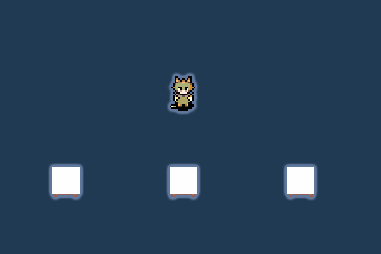
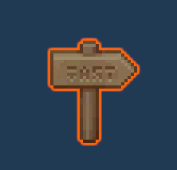
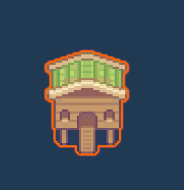

# HuangShuohao_M17UF2R1

*Nombre aún pendiente*

Es un juego roguelike generado proceduralmente que trata de alimentar a animalitos gruñones que quieren comerte vivo. No son malos, solo están hambrientos.

Los animalitos te atacarán de tres formas: persiguiéndote, escupiéndote, y dándote cariñitos antes de desmayarse de hambre.

- **Perseguir**: Ira a por ti a toda velocidad  

- **Cariñitos**: Tiene demasiado hambre para correr, se acercará lentamente y te avisará que te dará cariñitos  

- **Escupir**: No confía mucho en ti y te escupirá desde lo lejos  

Si acaban bien alimentados volveran a ser civilizados y ten pagaran por la comida

En este título no hay fin, excepto la muerte del personaje.

## Controles

- **Movimiento**: AWSD  
- **Acción**: Click izquierdo  
- **Interactuar/Coger**: F  
- **Inspeccionar ítem**: R  

## Objetos

- **Uvas**: Perfectas para alimentar a los pobres animalitos.  

- **Granadas**: No los saciarán, pero te conseguirán algo de tiempo.  

- **Fluflu**: A veces hay que recurrir a medidas drásticas.  

- **Baguette**: No recomendado.  

## Interactuables

- **Tienda felina**: Es una parada de un gatito que te venderá artículos que posiblemente ya tengas, pero es mono, ¡así que cómprale!  

- **Cartel**: El cartel te indicará la siguiente entrada.  

## Otros

- **Casa**: Hogar acogedor donde aparece el jugador  

## Dev

### Reconfiguración de Objetos
Los objetos solo se pueden reconfigurar desde los Scriptable Objects.  
**Ruta**: `Assets/ScriptableObjects/ItemSO`

### Reconfiguración de Animalitos
Los animalitos se reconfiguran directamente en el código o en los prefabs.  
**Ruta prefab**: `Assets/Resources/Enemies`  
**Ruta scripts**: `Assets/Scripts/Enemies`

### Reconfiguración de Mapa
Los parámetros del mapa se encuentran en el Grid de la escena **DUNGEON**.  

Los parámetros de la sala deben modificarse únicamente en el script `RoomBehavior.cs`.  
**Ruta**: `Assets/Scripts/Map/RoomBehavior.cs`

### Cheats de Desarrollador
Se pueden modificar los parámetros en PLAY de la vida y el oro del jugador desde los ScriptableObjects `PCHealth` y `PCGold`.  
**Ruta**: `Assets/ScriptableObjects/EventsSO`
